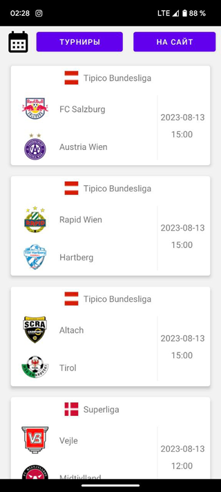
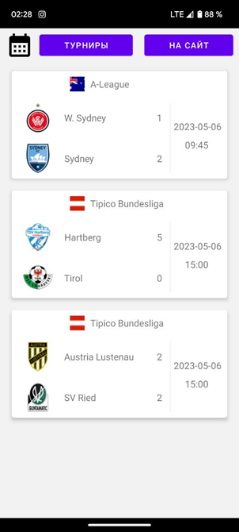
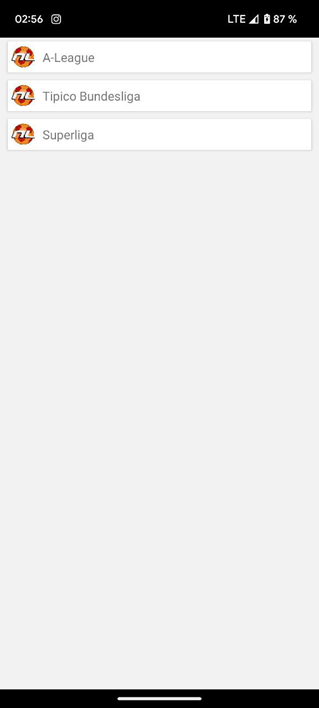
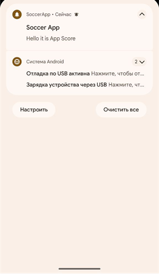

# SoccerAPP

При открытии приложения открывается экран приветсвия.
Далее открывается экран со списками матчей на сегодня.
Можно нажать на инонку календаря и выбрать дату.
После выбора даты открывается список матчей на выбранный день

Если выбранный день является прошедшим днем,
то показывается результат матча

Также при нажатии на кнопку "Турниры" открывается список лиг

При нажатии на кнопку "На сайт" открывается веб-страница.
В этом фрагменте настраивается one signal.
Push-уведомление успешно приходит

